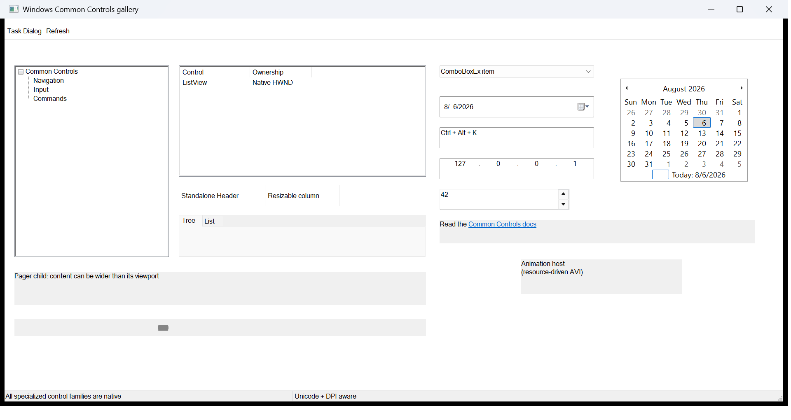

<p align="center">
  
</p>

<h1 align="center">mwtl</h1>

<p align="center">A lightweight C++20 foundation for native Windows desktop applications.</p>

<p align="center">
  <a href="https://github.com/everettjf/mwtl/actions/workflows/ci.yml"></a>
  <a href="LICENSE"></a>
  
  
</p>

<p align="center">
  <a href="#quick-start">Quick start</a> &middot;
  <a href="#installation">Installation</a> &middot;
  <a href="#examples">Examples</a> &middot;
  <a href="https://everettjf.github.io/mwtl/components/">Components</a> &middot;
  <a href="https://everettjf.github.io/mwtl/">Documentation</a>
</p>

mwtl wraps real HWND controls with clear ownership, typed events, checked setup
helpers, and DPI-aware responsive layout. It reduces Win32 ceremony without
hiding native handles, messages, styles, or return values.

## Quick start

```cpp
#include <mwtl/mwtl.h>

using mwtl::operator""_dip;

class MainWindow final : public mwtl::WindowBase {
public:
    void BuildUI() override {
        SetTitle(L"Hello, mwtl");

        mwtl::ControlHost ui{*this};
        ui.Add(message_, L"A native Windows UI with modern C++20 ergonomics.");
        ui.Add(close_, L"Close");

        SetLayout(
            mwtl::Column()
                .Margin(24_dip)
                .Gap(12_dip)
                .Add(message_, mwtl::Auto())
                .Add(close_, mwtl::Fixed(36_dip)));
    }

    mwtl::EventResult OnCommand(
        const mwtl::CommandEvent& event) override {
        if (event.IsClicked(close_)) {
            Close();
            return mwtl::EventResult::Handled();
        }
        return mwtl::EventResult::Propagate();
    }

private:
    mwtl::Label message_;
    mwtl::Button close_;
};

int WINAPI wWinMain(
    HINSTANCE instance, HINSTANCE, PWSTR, int show_command) {
    return mwtl::RunApplication<MainWindow>(instance, show_command);
}
```

`ControlHost` allocates control IDs automatically. `SetLayout` owns the layout
tree and rearranges native controls on resize. Event handlers override only the
messages the window needs.

## Installation

The recommended integration is CMake `FetchContent`:

```cmake
cmake_minimum_required(VERSION 3.21)
project(my_app LANGUAGES CXX)

include(FetchContent)
FetchContent_Declare(mwtl
  GIT_REPOSITORY https://github.com/everettjf/mwtl.git
  GIT_TAG main
  GIT_SHALLOW TRUE)
FetchContent_MakeAvailable(mwtl)

add_executable(my_app WIN32 main.cpp)
target_link_libraries(my_app PRIVATE mwtl::mwtl)
```

```powershell
cmake -S . -B build -G "Visual Studio 18 2026" -A x64
cmake --build build --config Debug
```

Use `Visual Studio 17 2022` with Visual Studio 2022. The complete
[setup guide](https://everettjf.github.io/mwtl/building.html) also covers an
installed `find_package` package, the Visual Studio folder workflow, VS Code,
offline WTL/WIL sources, and building this repository.

## What is included

- application and message-loop lifetime management;
- `WindowBase` with typed keyboard, mouse, resize, timer, DPI, command,
  notification, paint, and native-message events;
- 27 native child-control wrappers;
- automatic control IDs and source-located checked operations;
- C++20 range-based batch population;
- DPI-aware row, column, and overlay layout;
- menus, accelerators, modern file/folder dialogs, clipboard, shell drops,
  window placement, task dialogs, image lists, and tooltips;
- wait-aware message pumping and lifetime-safe worker wakeups.

The [component reference](https://everettjf.github.io/mwtl/components/) shows
every control with current code, a native screenshot, and its runnable example.
Detailed API notes live in [docs/api.md](docs/api.md).

## Examples

The repository contains 22 independently buildable programs. Each link opens
the complete source.

| Example | Source | Focus |
|---|---|---|
| Hello | [examples/hello/main.cpp](examples/hello/main.cpp) | Smallest complete native application |
| Application | [examples/application/main.cpp](examples/application/main.cpp) | Startup, message loop, and exit lifecycle |
| Window | [examples/window/main.cpp](examples/window/main.cpp) | HWND access, typed events, and native messages |
| Native message | [examples/native_message/main.cpp](examples/native_message/main.cpp) | Application-defined `WM_APP` messages |
| Keyboard | [examples/keyboard/main.cpp](examples/keyboard/main.cpp) | Typed key input |
| Mouse | [examples/mouse/main.cpp](examples/mouse/main.cpp) | Client coordinates and clicks |
| Resize | [examples/resize/main.cpp](examples/resize/main.cpp) | Client size and window state |
| Timer | [examples/timer/main.cpp](examples/timer/main.cpp) | RAII timers with `std::chrono` |
| Paint | [examples/paint/main.cpp](examples/paint/main.cpp) | Native GDI drawing |
| Minimum size | [examples/minmax/main.cpp](examples/minmax/main.cpp) | `WM_GETMINMAXINFO` |
| Close policy | [examples/close_policy/main.cpp](examples/close_policy/main.cpp) | Typed close interception |
| Window state | [examples/window_state/main.cpp](examples/window_state/main.cpp) | Restore, minimize, and maximize |
| DPI | [examples/dpi/main.cpp](examples/dpi/main.cpp) | Per-monitor DPI behavior |
| Window options | [examples/window_options/main.cpp](examples/window_options/main.cpp) | Styles, resources, and DIP bounds |
| Wait-aware pump | [examples/wait_aware/main.cpp](examples/wait_aware/main.cpp) | Handles and efficient idle work |
| Wakeup | [examples/wakeup/main.cpp](examples/wakeup/main.cpp) | Safe worker-to-window notification |
| COM STA | [examples/com_sta/main.cpp](examples/com_sta/main.cpp) | COM apartment lifecycle |
| Controls | [examples/controls/main.cpp](examples/controls/main.cpp) | Complete form-control gallery |
| Common Controls | [examples/common_controls/main.cpp](examples/common_controls/main.cpp) | Complete specialized-control gallery |
| Self-drawn host | [examples/self_drawn_host/main.cpp](examples/self_drawn_host/main.cpp) | Worker-driven native drawing |
| System lifecycle | [examples/system_lifecycle/main.cpp](examples/system_lifecycle/main.cpp) | Power, display, IME, and session messages |
| Hot corners | [examples/hot_corners/main.cpp](examples/hot_corners/main.cpp) | Complete multi-monitor utility |

<p align="center">
  <a href="examples/hello/main.cpp"></a>
  <a href="examples/controls/main.cpp"></a>
</p>
<p align="center">
  <a href="examples/common_controls/main.cpp"></a>
  <a href="examples/paint/main.cpp"></a>
</p>

The [examples catalog](examples/README.md) lists target names and run commands.
The [website](https://everettjf.github.io/mwtl/) displays every example with
its screenshot and source link.

## Build this repository

Requirements: Windows 10 1809 or newer, x64 or ARM64, Visual Studio 2022 or newer with
MSVC, a Windows SDK and C++ ATL, CMake 3.21 or newer, and C++20.

```powershell
cmake --preset vs2026-x64
cmake --build --preset x64-debug
ctest --preset x64-debug
```

On an ARM64 development machine use `vs2026-arm64`, `arm64-debug`, and the
matching `arm64-debug` test preset.

Build and test Release:

```powershell
cmake --build --preset x64-release
ctest --preset x64-release
```

The project rejects non-Windows, non-MSVC-compatible ABI, and 32-bit
configurations. CI validates MSVC x64 and ARM64, clang-cl, AddressSanitizer,
Debug/Release, public-header independence, package consumption, manifests,
examples, resource lifetime, API surface, deterministic property cases, and a
74% native source-coverage floor with an archived Cobertura report.

## Dependencies

CMake fetches pinned official WTL and Microsoft WIL revisions. Exact sources
and licenses are recorded in [THIRD_PARTY_NOTICES.md](THIRD_PARTY_NOTICES.md).
For controlled environments, see the
[offline setup instructions](https://everettjf.github.io/mwtl/building.html#offline).

## Documentation

- [Get started](https://everettjf.github.io/mwtl/building.html)
- [Component reference](https://everettjf.github.io/mwtl/components/)
- [Current API notes](docs/api.md)
- [Public header reference](docs/reference.md)
- [Design and scope](docs/design.md)
- [API stability](docs/stability.md)
- [Migrating from 0.5 to 0.6](docs/migration-0.6.md)
- [Accessibility and keyboard checklist](docs/accessibility.md)
- [System-message recipes](docs/system-message-recipes.md)
- [Contributing](CONTRIBUTING.md)

## License

[MIT](LICENSE). WTL, WIL, and other third-party dependencies retain their own
licenses.
