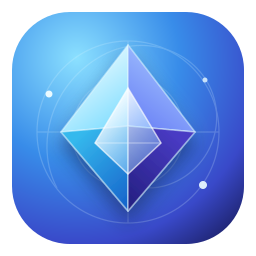
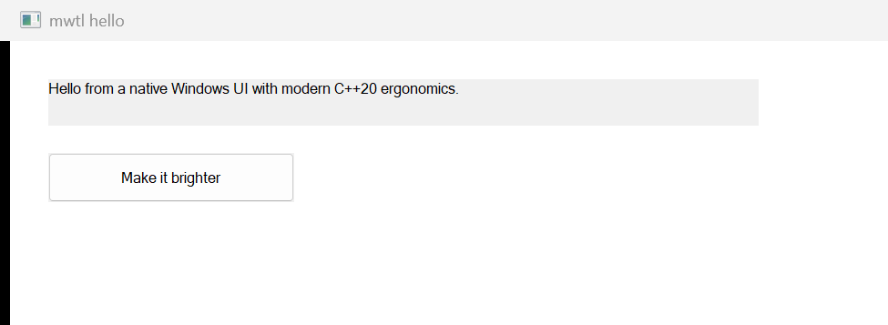
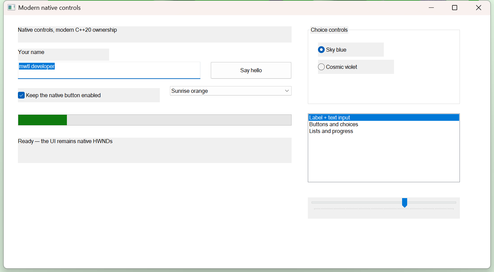
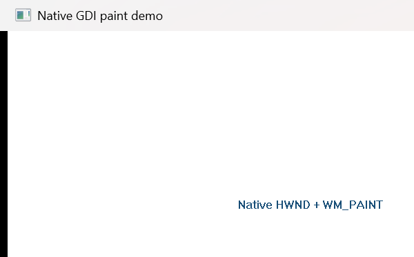

<p align="center">
  
</p>

<h1 align="center">mwtl</h1>

<p align="center">
  A bright, lightweight C++20 foundation for native Windows desktop applications.
</p>

<p align="center">
  <a href="https://github.com/everettjf/mwtl/actions/workflows/ci.yml"></a>
  <a href="https://github.com/everettjf/mwtl/blob/main/LICENSE"></a>
  
  
</p>

<p align="center">
  <a href="#hello-world">Hello World</a> &middot;
  <a href="#visual-quick-start">Examples</a> &middot;
  <a href="#build-and-run">Build</a> &middot;
  <a href="https://everettjf.github.io/mwtl/">Documentation</a> &middot;
  <a href="docs/api-0.2.md">API &amp; ownership</a>
</p>

`mwtl` is a lightweight, Windows-only modern C++ foundation built on ATL/WTL and Microsoft WIL. It keeps native HWND and Win32 message interoperability while reducing application/bootstrap boilerplate and making lifetime and error boundaries explicit.

The project is not a replacement for Qt, WinUI, XAML/QML, or a cross-platform/full-visual UI framework. It favors native Windows controls and does not hide HWNDs.

## Hello World

This is a complete native Windows application:

```cpp
#include <mwtl/mwtl.h>

class HelloWindow final : public mwtl::WindowBase {
public:
    void BuildUI() override {
        SetTitle(L"Hello, world!");
    }
};

int WINAPI wWinMain(HINSTANCE instance, HINSTANCE, PWSTR, int show) {
    return mwtl::RunApplication<HelloWindow>(instance, show);
}
```

No message-map macros, generated code, framework-owned application object, or
hidden HWND abstraction is required. Start with one class and add native
controls only when the window needs them.

## Visual quick start

The most useful visual examples put the essential code on the left and the
actual x64 Debug window on the right. Infrastructure demos with visually empty
windows stay in the full catalog instead of taking over the front page.

<table>
  <tr>
    <th width="54%" align="left">Hello: native label and button</th>
    <th width="46%" align="left">Result</th>
  </tr>
  <tr>
    <td valign="top"><pre><code>void BuildUI() {
    message_.Create(*this, {100}, L"Hello, mwtl", bounds);
    button_.Create(*this, {101}, L"Try it", button_bounds);
}

mwtl::EventResult OnCommand(const mwtl::CommandEvent&amp; event) override {
    if (event.IsClicked(button_)) {
        message_.SetText(L"No message-map macros.");
        return mwtl::EventResult::Handled();
    }
    return mwtl::EventResult::Propagate();
}</code></pre><a href="examples/hello/main.cpp">Open the complete Hello source &rarr;</a></td>
    <td valign="top"><a href="examples/hello/main.cpp"></a></td>
  </tr>
  <tr>
    <th align="left">Native controls: a complete small form</th>
    <th align="left">Result</th>
  </tr>
  <tr>
    <td valign="top"><pre><code>void BuildUI() {
    name_.Create(*this, {102}, L"mwtl developer", name_bounds);
    greet_.Create(*this, {103}, L"Say hello", button_bounds);
    enabled_.Create(*this, {104}, L"Button enabled", check_bounds);
    accent_.Create(*this, {105}, combo_bounds);
    progress_.Create(*this, {106}, progress_bounds);
    group_.Create(*this, {107}, L"Choices", group_bounds);
    radio_.Create(*this, {108}, L"Sky blue", radio_bounds);
    list_.Create(*this, {109}, list_bounds);
    slider_.Create(*this, {110}, slider_bounds);
    heartbeat_.Start(*this, {1}, 1s);
}

mwtl::EventResult OnCommand(const mwtl::CommandEvent&amp; event) override {
    if (event.IsClicked(greet_)) {
        status_.SetText(L"Hello, " + name_.GetText());
        return mwtl::EventResult::Handled();
    }
    return mwtl::EventResult::Propagate();
}</code></pre><a href="examples/controls/main.cpp">Open the complete controls source &rarr;</a></td>
    <td valign="top"><a href="examples/controls/main.cpp"></a></td>
  </tr>
  <tr>
    <th align="left">Native painting: direct GDI remains available</th>
    <th align="left">Result</th>
  </tr>
  <tr>
    <td valign="top"><pre><code>void OnPaint(mwtl::PaintEvent&amp; event) {
    ::FillRect(event.GetDC(), &amp;client, background);
    ::DrawTextW(event.GetDC(), text, -1, &amp;client,
                DT_CENTER | DT_VCENTER | DT_SINGLELINE);
}</code></pre><a href="examples/paint/main.cpp">Open the complete painting source &rarr;</a></td>
    <td valign="top"><a href="examples/paint/main.cpp"></a></td>
  </tr>
</table>

## Capabilities and project scope

The current library provides:

- macro-free C++20 convention handlers discovered with `requires`;
- typed keyboard, mouse, resize, DPI, command, timer, paint, min/max, and raw-message events;
- RAII `UiTimer` with `std::chrono` intervals;
- ten native wrappers: Label, Button, TextBox, CheckBox, RadioButton, GroupBox,
  ComboBox, ListBox, ProgressBar, and Slider;
- one-line `RunApplication<MainWindow>()` process startup;
- DIP geometry conversion and per-window `DpiContext`;
- configurable class traits, styles, icons/cursor/background, and initial bounds;
- automatic `WM_DPICHANGED` suggested-rectangle handling (opt-out is explicit);
- a `MsgWaitForMultipleObjectsEx` pump preserving WTL message filters;
- a lifetime-safe, non-owning `WindowWakeup` token for worker-to-UI notification;
- optional application-owned STA/MTA COM initialization;
- a C++20 public API using concepts, `std::span`, three-way comparison,
  designated initializers, and `std::jthread` in the focused examples;
- independent C++20 consumer and public-header compile checks.

Build and runtime foundations include:

- a CMake static library target named `mwtl::mwtl`;
- pinned official WTL and WIL dependencies;
- `mwtl::Application` with WTL `CAppModule` and message-loop lifetime management;
- a concise `mwtl::WindowBase` for ordinary windows and CRTP `Window<T>` for
  advanced compile-time/WTL message-map integration;
- exception containment around real WTL window-message dispatch and `wWinMain`;
- Unicode-only compilation and a Per-Monitor DPI Awareness V2 manifest for the hello executable;
- an interactive native-control `examples/hello` quick start;
- focused `Application` and `Window<T>` component demos under `examples/`;
- CTest coverage for normal exit, creation failure cleanup, message-handler exceptions, public-header independence, and the embedded DPI manifest;
- a static component documentation site under `site/`, ready for GitHub Pages deployment.

There is currently no layout system, declarative control DSL, theme/font system, general task dispatcher, Mica/backdrop, Direct2D, DirectWrite, terminal, or ConPTY abstraction. The control wrappers deliberately remain thin owners of real system HWNDs.

## Requirements

- Windows 10 version 1809 or newer, or Windows 11;
- x64 or ARM64;
- Visual Studio 2022 or newer with the MSVC C++ desktop tools, Windows SDK, and C++ ATL component;
- CMake 3.21 or newer;
- C++20 (`/std:c++20`) is the required and publicly propagated language standard.

mwtl intentionally fails during CMake configuration on non-Windows, non-MSVC,
and 32-bit targets. MinGW and clang-cl are not supported.

## Dependencies

The default configuration fetches immutable commits from the official WTL SourceForge repository and Microsoft WIL GitHub repository. Exact tags, commits, and licenses are recorded in [THIRD_PARTY_NOTICES.md](THIRD_PARTY_NOTICES.md).

For offline builds, provide both checked-out source trees:

```powershell
cmake -S . -B build/x64 `
  -G "Visual Studio 17 2022" -A x64 `
  -DMWTL_WTL_SOURCE_DIR=C:/deps/wtl `
  -DMWTL_WIL_SOURCE_DIR=C:/deps/wil
```

An embedding project may instead define `WTL::WTL` and `WIL::WIL` targets before calling `add_subdirectory(mwtl)`. If either target is already present, mwtl uses it and does not fetch that dependency. It never searches silently for an unidentified system copy.

## Build and run

The checked-in presets provide the shortest path when dependencies can be fetched:

```powershell
cmake --preset vs2026-x64
cmake --build --preset x64-debug
ctest --preset x64-debug
```

From a Visual Studio 2026 Developer PowerShell, configure once and build Debug x64:

```powershell
cmake -S . -B build/x64 -G "Visual Studio 18 2026" -A x64 `
  -DMWTL_BUILD_EXAMPLES=ON -DMWTL_BUILD_TESTS=ON
cmake --build build/x64 --config Debug --verbose
ctest --test-dir build/x64 -C Debug --output-on-failure
./build/x64/examples/hello/Debug/mwtl_hello.exe
```

Build Release x64:

```powershell
cmake --build build/x64 --config Release --verbose
ctest --test-dir build/x64 -C Release --output-on-failure
./build/x64/examples/hello/Release/mwtl_hello.exe
```

On a machine with the MSVC ARM64 compiler, ARM64 ATL libraries, and ARM64 Windows SDK libraries installed:

```powershell
cmake -S . -B build/arm64 -G "Visual Studio 18 2026" -A ARM64
cmake --build build/arm64 --config Debug --verbose
cmake --build build/arm64 --config Release --verbose
```

When mwtl is included with `add_subdirectory`, examples and tests default to off. Set `MWTL_BUILD_EXAMPLES=ON` or `MWTL_BUILD_TESTS=ON` explicitly when the parent wants them.

## Component examples

The repository contains **20 independently buildable GUI examples**. They are all managed by [examples/CMakeLists.txt](examples/CMakeLists.txt) and share the same Unicode, C++20, warning, and Per-Monitor V2 manifest setup. Every name and screenshot below links directly to its complete `main.cpp`.

| Component | Directory | CMake target | Demonstrates |
|---|---|---|---|
| Quick start | [`examples/hello`](examples/hello/main.cpp) | `mwtl_hello` | Smallest complete program |
| `mwtl::Application` | [`examples/application`](examples/application/main.cpp) | `mwtl_application_demo` | HINSTANCE observation, Run, exit code, and wWinMain boundary |
| Window APIs | [`examples/window`](examples/window/main.cpp) | `mwtl_window_demo` | `WindowBase`, advanced `Window<T>`, HWND access, WM_APP messages, and `Close()` |
| Native message | [`examples/native_message`](examples/native_message/main.cpp) | `mwtl_native_message_demo` | Typed `WM_APP` constant, payload, `PostMessageW`, and `OnMessage` |
| Keyboard | [`examples/keyboard`](examples/keyboard/main.cpp) | `mwtl_keyboard_demo` | `WM_KEYDOWN`, virtual-key values, and Escape-to-close |
| Mouse | [`examples/mouse`](examples/mouse/main.cpp) | `mwtl_mouse_demo` | Client coordinates from `WM_MOUSEMOVE` and `WM_LBUTTONDOWN` |
| Resize | [`examples/resize`](examples/resize/main.cpp) | `mwtl_resize_demo` | Width, height, and state from `WM_SIZE` |
| Timer | [`examples/timer`](examples/timer/main.cpp) | `mwtl_timer_demo` | `UiTimer`, `std::chrono`, typed timer IDs, and RAII cleanup |
| Native paint | [`examples/paint`](examples/paint/main.cpp) | `mwtl_paint_demo` | Direct HWND/GDI interoperability through `WM_PAINT` |
| Minimum size | [`examples/minmax`](examples/minmax/main.cpp) | `mwtl_minmax_demo` | A native minimum tracking size through `WM_GETMINMAXINFO` |
| Close policy | [`examples/close_policy`](examples/close_policy/main.cpp) | `mwtl_close_policy_demo` | Intercepting `WM_CLOSE` without changing `Application` lifetime policy |
| Window state | [`examples/window_state`](examples/window_state/main.cpp) | `mwtl_window_state_demo` | Restored, minimized, and maximized state from `WM_SIZE` |
| DPI | [`examples/dpi`](examples/dpi/main.cpp) | `mwtl_dpi_demo` | Per-window DPI and `WM_DPICHANGED` |
| Window options | [`examples/window_options`](examples/window_options/main.cpp) | `mwtl_window_options_demo` | Class traits, styles, DIP client size and centering |
| Wait-aware pump | [`examples/wait_aware`](examples/wait_aware/main.cpp) | `mwtl_wait_aware_demo` | Non-busy message/timer waiting |
| Safe wake-up | [`examples/wakeup`](examples/wakeup/main.cpp) | `mwtl_wakeup_demo` | Worker-to-HWND lifetime-safe wake notification |
| COM STA | [`examples/com_sta`](examples/com_sta/main.cpp) | `mwtl_com_sta_demo` | Optional COM apartment lifecycle |
| Native controls | [`examples/controls`](examples/controls/main.cpp) | `mwtl_controls_demo` | Every supported control: text, buttons, choices, lists, progress, slider, commands, and timer |
| Self-drawn host | [`examples/self_drawn_host`](examples/self_drawn_host/main.cpp) | `mwtl_self_drawn_host_demo` | Dirty-frame wake-up, native GDI and wait-aware pumping |
| System lifecycle | [`examples/system_lifecycle`](examples/system_lifecycle/main.cpp) | `mwtl_system_lifecycle_demo` | Power/display/settings/IME/end-session/accessibility messages |

Build any one directly, for example:

```powershell
cmake --build build/x64 --config Debug --target mwtl_native_message_demo
./build/x64/examples/native_message/Debug/mwtl_native_message_demo.exe
```

See [examples/README.md](examples/README.md) for the complete target and run-command index.

## Tests

`MWTL_BUILD_TESTS` defaults on for a top-level build and off when mwtl is embedded. The test suite covers:

- successful main-window creation and normal loop exit;
- deterministic module-initialization and message-loop-registration failure cleanup;
- `BuildUI` exception causing Create failure and nonzero Run result;
- a WTL message-handler exception being contained by the real WindowProc boundary;
- exact `CAppModule`/message-loop cleanup counts on each path;
- independent C++20 compilation of every public header;
- macro-free convention dispatch and common native-control/timer lifecycle;
- extraction and inspection of the final hello EXE manifest with the Windows SDK manifest tool.
- DPI conversion edge cases, C++20 consumption, custom class traits, COM STA,
  wait-handle dispatch, callback exception containment, 2,000-message wake-up
  bursts, idle CPU behavior, and a liney-style native host fixture.

The repository CI workflow builds and tests x64 Debug and Release and separately cross-builds Debug and Release for ARM64.

## GitHub Pages

The documentation site source is in [site/](site/). It includes a landing page, build guide, and one usage page for every current public component. The pinned-action workflow [.github/workflows/pages.yml](.github/workflows/pages.yml) uploads that directory directly to GitHub Pages.

After the repository is public, open **Settings → Pages**, select **GitHub Actions** as the source, then run the **Deploy GitHub Pages** workflow or push a change under `site/` to `main`. No Jekyll or Node build is required.

## Development documents

Release history and implementation evidence live below the getting-started
material: [development plan](docs/mwtl-0.2-plan.md),
[design](docs/mwtl-0.2-design.md), [API and ownership](docs/api-0.2.md),
[liney-win migration spike](docs/liney-win-migration-spike.md),
[system-message recipes](docs/system-message-recipes.md),
[release notes](docs/release-notes-0.2.0.md),
[performance evidence](docs/performance-0.2.0.md), and the
[release checklist](docs/release-checklist-0.2.0.md).

## Modern event handlers

`WindowBase` exposes ordinary virtual event overrides and is the recommended
default. There is no registration table or message-map macro:

```cpp
mwtl::EventResult OnKeyDown(const mwtl::KeyEvent& event) override;
mwtl::EventResult OnMouseMove(const mwtl::MouseEvent& event) override;
mwtl::EventResult OnResize(const mwtl::ResizeEvent& event) override;
mwtl::EventResult OnCommand(const mwtl::CommandEvent& event) override;
mwtl::EventResult OnTimer(mwtl::TimerId id) override;
mwtl::EventResult OnPaint(mwtl::PaintEvent& event) override;
mwtl::EventResult OnMessage(const mwtl::WindowMessage& message) override;
```

Return `EventResult::Propagate()` when WTL/default processing should continue,
or `EventResult::Handled(value)` when a specific native result is required.
The advanced `Window<T>` form instead discovers handlers at compile time with
C++20 `requires` and also permits consuming `void` handlers.

### Typed keyboard input

```cpp
class KeyboardWindow final : public mwtl::WindowBase {
public:
    void BuildUI() override { SetTitle(L"Press Escape to close"); }

    mwtl::EventResult OnKeyDown(const mwtl::KeyEvent& event) override {
        if (event.virtual_key == VK_ESCAPE) {
            static_cast<void>(Close());
            return mwtl::EventResult::Handled();
        }
        return mwtl::EventResult::Propagate();
    }
};
```

### Common native controls

```cpp
using mwtl::operator""_dip;

void BuildUI() {
    name_.Create(*this, {100}, L"Ada",
                 {{24.0_dip, 24.0_dip}, {280.0_dip, 32.0_dip}});
    greet_.Create(*this, {101}, L"Greet",
                  {{320.0_dip, 24.0_dip}, {120.0_dip, 32.0_dip}});
}

void OnCommand(const mwtl::CommandEvent& event) {
    if (event.IsClicked(greet_)) {
        SetTitle(L"Hello, " + name_.GetText());
    }
}

mwtl::TextBox name_;
mwtl::Button greet_;
```

The wrappers own real child HWNDs. The controls gallery creates every supported
wrapper: Label, Button, TextBox, CheckBox, RadioButton, GroupBox, ComboBox,
ListBox, ProgressBar, and Slider. Each exposes `GetHwnd()` whenever direct
Win32 access is useful.

### RAII timer with chrono

```cpp
using namespace std::chrono_literals;

void BuildUI() {
    if (!timer_.Start(*this, kRefreshTimer, 1s)) {
        throw std::runtime_error("timer start failed");
    }
}

void OnTimer(mwtl::TimerId id) {
    if (id == kRefreshTimer) {
        Refresh();
    }
}

static constexpr mwtl::TimerId kRefreshTimer{1};
mwtl::UiTimer timer_;  // KillTimer is automatic.
```

### Raw messages and WTL compatibility

```cpp
static constexpr UINT kRefresh = WM_APP + 1;

mwtl::EventResult OnMessage(const mwtl::WindowMessage& message) {
    if (message.id == kRefresh) {
        return mwtl::EventResult::Handled(42);
    }
    return mwtl::EventResult::Propagate();
}
```

Existing WTL `BEGIN_MSG_MAP` code remains source-compatible. A derived WTL map
can still chain to `mwtl::Window<T>`; the convention layer and the legacy map
both execute inside the same `SafeWindowProc` exception boundary.

## License

mwtl is licensed under the MIT License. See [LICENSE](LICENSE). Third-party dependencies retain their own licenses and do not imply Microsoft or upstream endorsement.
