<p align="center">
  
</p>

<h1 align="center">mwtl</h1>

<p align="center">
  A bright, lightweight C++20 foundation for native Windows desktop applications.
</p>

<p align="center">
  <a href="https://github.com/everettjf/mwtl/actions/workflows/ci.yml"></a>
  <a href="https://github.com/everettjf/mwtl/blob/main/LICENSE"></a>
  
  
</p>

<p align="center">
  <a href="#build-and-run">Build</a> ·
  <a href="#example-gallery">Examples</a> ·
  <a href="https://everettjf.github.io/mwtl/">Documentation</a> ·
  <a href="docs/api-0.2.md">API &amp; ownership</a>
</p>

`mwtl` is a lightweight, Windows-only modern C++ foundation built on ATL/WTL and Microsoft WIL. It keeps native HWND and Win32 message interoperability while reducing application/bootstrap boilerplate and making lifetime and error boundaries explicit.

The project is not a replacement for Qt, WinUI, XAML/QML, or a cross-platform/full-visual UI framework. It favors native Windows controls and does not hide HWNDs.

## Current status

Version 0.2 extends the milestone-1 foundation with:

- DIP geometry conversion and per-window `DpiContext`;
- configurable class traits, styles, icons/cursor/background, and initial bounds;
- automatic `WM_DPICHANGED` suggested-rectangle handling (opt-out is explicit);
- a `MsgWaitForMultipleObjectsEx` pump preserving WTL message filters;
- a lifetime-safe, non-owning `WindowWakeup` token for worker-to-UI notification;
- optional application-owned STA/MTA COM initialization;
- a C++20 public API using concepts, `std::span`, three-way comparison,
  designated initializers, and `std::jthread` in the focused examples;
- independent C++20 consumer and public-header compile checks.

The original foundation provides:

- a CMake static library target named `mwtl::mwtl`;
- pinned official WTL and WIL dependencies;
- `mwtl::Application` with WTL `CAppModule` and message-loop lifetime management;
- a CRTP `mwtl::Window<T>` main-window base with native HWND access;
- exception containment around real WTL window-message dispatch and `wWinMain`;
- Unicode-only compilation and a Per-Monitor DPI Awareness V2 manifest for the hello executable;
- a blank, closable `examples/hello` quick start;
- focused `Application` and `Window<T>` component demos under `examples/`;
- CTest coverage for normal exit, creation failure cleanup, message-handler exceptions, public-header independence, and the embedded DPI manifest;
- a static component documentation site under `site/`, ready for GitHub Pages deployment.

There is currently no layout system, control DSL/wrappers, theme/font system, general task dispatcher, Mica/backdrop, Direct2D, DirectWrite, terminal, or ConPTY abstraction.

The [`v0.2.0` development plan](docs/mwtl-0.2-plan.md) defines the
advanced native window host: configurable HWND creation, per-window DPI,
wait-aware message pumping, thread-safe wake-up, system lifecycle
interoperability, and a liney-win migration spike. It does not move terminal,
rendering, or workspace product logic into mwtl.

Implementation details are recorded in the [0.2 design](docs/mwtl-0.2-design.md),
the [API and ownership reference](docs/api-0.2.md),
the [liney-win migration spike](docs/liney-win-migration-spike.md), and the
[native system-message recipes](docs/system-message-recipes.md). See also the
[0.2.0 release notes](docs/release-notes-0.2.0.md).
Performance results and the remaining manual gates are in the
[0.2 evidence](docs/performance-0.2.0.md) and
[release checklist](docs/release-checklist-0.2.0.md).

## Requirements

- Windows 10 version 1809 or newer, or Windows 11;
- x64 or ARM64;
- Visual Studio 2022 or newer with the MSVC C++ desktop tools, Windows SDK, and C++ ATL component;
- CMake 3.21 or newer;
- C++20 (`/std:c++20`) is the required and publicly propagated language standard.

Milestone 1 intentionally fails during CMake configuration on non-Windows, non-MSVC, and 32-bit targets. MinGW and clang-cl are not supported.

## Dependencies

The default configuration fetches immutable commits from the official WTL SourceForge repository and Microsoft WIL GitHub repository. Exact tags, commits, and licenses are recorded in [THIRD_PARTY_NOTICES.md](THIRD_PARTY_NOTICES.md).

For offline builds, provide both checked-out source trees:

```powershell
cmake -S . -B build/x64 `
  -G "Visual Studio 17 2022" -A x64 `
  -DMWTL_WTL_SOURCE_DIR=C:/deps/wtl `
  -DMWTL_WIL_SOURCE_DIR=C:/deps/wil
```

An embedding project may instead define `WTL::WTL` and `WIL::WIL` targets before calling `add_subdirectory(mwtl)`. If either target is already present, mwtl uses it and does not fetch that dependency. It never searches silently for an unidentified system copy.

## Build and run

The checked-in presets provide the shortest path when dependencies can be fetched:

```powershell
cmake --preset vs2026-x64
cmake --build --preset x64-debug
ctest --preset x64-debug
```

From a Visual Studio 2026 Developer PowerShell, configure once and build Debug x64:

```powershell
cmake -S . -B build/x64 -G "Visual Studio 18 2026" -A x64 `
  -DMWTL_BUILD_EXAMPLES=ON -DMWTL_BUILD_TESTS=ON
cmake --build build/x64 --config Debug --verbose
ctest --test-dir build/x64 -C Debug --output-on-failure
./build/x64/examples/hello/Debug/mwtl_hello.exe
```

Build Release x64:

```powershell
cmake --build build/x64 --config Release --verbose
ctest --test-dir build/x64 -C Release --output-on-failure
./build/x64/examples/hello/Release/mwtl_hello.exe
```

On a machine with the MSVC ARM64 compiler, ARM64 ATL libraries, and ARM64 Windows SDK libraries installed:

```powershell
cmake -S . -B build/arm64 -G "Visual Studio 18 2026" -A ARM64
cmake --build build/arm64 --config Debug --verbose
cmake --build build/arm64 --config Release --verbose
```

When mwtl is included with `add_subdirectory`, examples and tests default to off. Set `MWTL_BUILD_EXAMPLES=ON` or `MWTL_BUILD_TESTS=ON` explicitly when the parent wants them.

## Component examples

The repository contains **19 independently buildable GUI examples**. They are all managed by [examples/CMakeLists.txt](examples/CMakeLists.txt) and share the same Unicode, C++20, warning, and Per-Monitor V2 manifest setup. Every name and screenshot below links directly to its complete `main.cpp`.

| Component | Directory | CMake target | Demonstrates |
|---|---|---|---|
| Quick start | [`examples/hello`](examples/hello/main.cpp) | `mwtl_hello` | Smallest complete program |
| `mwtl::Application` | [`examples/application`](examples/application/main.cpp) | `mwtl_application_demo` | HINSTANCE observation, Run, exit code, and wWinMain boundary |
| `mwtl::Window<T>` | [`examples/window`](examples/window/main.cpp) | `mwtl_window_demo` | HWND access, WTL message maps, WM_APP messages, and direct WM_CLOSE |
| Native message | [`examples/native_message`](examples/native_message/main.cpp) | `mwtl_native_message_demo` | Typed `WM_APP` constant, payload, `PostMessageW`, and a WTL handler |
| Keyboard | [`examples/keyboard`](examples/keyboard/main.cpp) | `mwtl_keyboard_demo` | `WM_KEYDOWN`, virtual-key values, and Escape-to-close |
| Mouse | [`examples/mouse`](examples/mouse/main.cpp) | `mwtl_mouse_demo` | Client coordinates from `WM_MOUSEMOVE` and `WM_LBUTTONDOWN` |
| Resize | [`examples/resize`](examples/resize/main.cpp) | `mwtl_resize_demo` | Width, height, and state from `WM_SIZE` |
| Timer | [`examples/timer`](examples/timer/main.cpp) | `mwtl_timer_demo` | `SetTimer`, `WM_TIMER`, and deterministic `KillTimer` cleanup |
| Native paint | [`examples/paint`](examples/paint/main.cpp) | `mwtl_paint_demo` | Direct HWND/GDI interoperability through `WM_PAINT` |
| Minimum size | [`examples/minmax`](examples/minmax/main.cpp) | `mwtl_minmax_demo` | A native minimum tracking size through `WM_GETMINMAXINFO` |
| Close policy | [`examples/close_policy`](examples/close_policy/main.cpp) | `mwtl_close_policy_demo` | Intercepting `WM_CLOSE` without changing `Application` lifetime policy |
| Window state | [`examples/window_state`](examples/window_state/main.cpp) | `mwtl_window_state_demo` | Restored, minimized, and maximized state from `WM_SIZE` |
| DPI | [`examples/dpi`](examples/dpi/main.cpp) | `mwtl_dpi_demo` | Per-window DPI and `WM_DPICHANGED` |
| Window options | [`examples/window_options`](examples/window_options/main.cpp) | `mwtl_window_options_demo` | Class traits, styles, DIP client size and centering |
| Wait-aware pump | [`examples/wait_aware`](examples/wait_aware/main.cpp) | `mwtl_wait_aware_demo` | Non-busy message/timer waiting |
| Safe wake-up | [`examples/wakeup`](examples/wakeup/main.cpp) | `mwtl_wakeup_demo` | Worker-to-HWND lifetime-safe wake notification |
| COM STA | [`examples/com_sta`](examples/com_sta/main.cpp) | `mwtl_com_sta_demo` | Optional COM apartment lifecycle |
| Self-drawn host | [`examples/self_drawn_host`](examples/self_drawn_host/main.cpp) | `mwtl_self_drawn_host_demo` | Dirty-frame wake-up, native GDI and wait-aware pumping |
| System lifecycle | [`examples/system_lifecycle`](examples/system_lifecycle/main.cpp) | `mwtl_system_lifecycle_demo` | Power/display/settings/IME/end-session/accessibility messages |

Build any one directly, for example:

```powershell
cmake --build build/x64 --config Debug --target mwtl_native_message_demo
./build/x64/examples/native_message/Debug/mwtl_native_message_demo.exe
```

See [examples/README.md](examples/README.md) for the complete target and run-command index.

## Example gallery

These screenshots were captured from the actual x64 Debug executables. Click any image or title to open that example's source.

<table>
  <tr>
    <td width="50%" valign="top"><a href="examples/hello/main.cpp"></a><br><strong><a href="examples/hello/main.cpp">Hello</a></strong><br><sub>The smallest complete mwtl application.</sub></td>
    <td width="50%" valign="top"><a href="examples/application/main.cpp">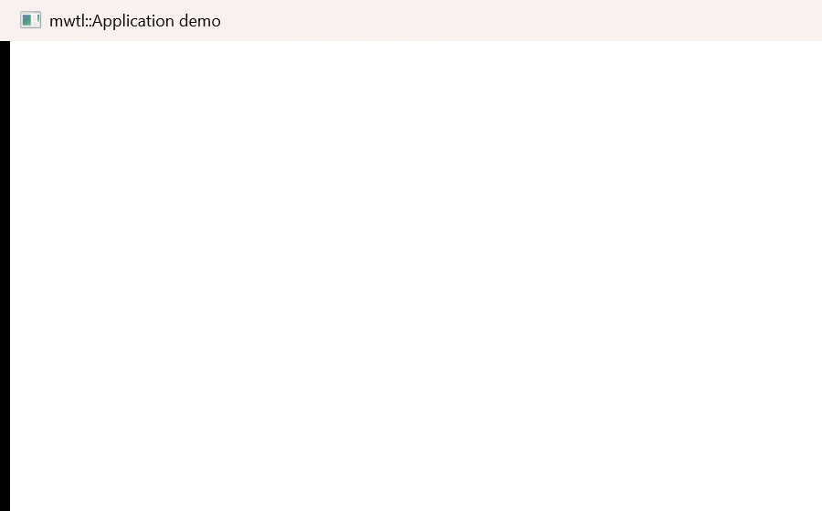</a><br><strong><a href="examples/application/main.cpp">Application</a></strong><br><sub>Application lifetime, instance access, and the ABI boundary.</sub></td>
  </tr>
  <tr>
    <td valign="top"><a href="examples/window/main.cpp">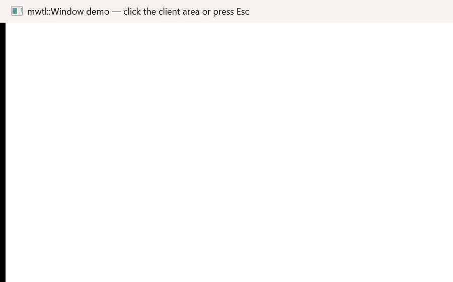</a><br><strong><a href="examples/window/main.cpp">Window</a></strong><br><sub>Native HWND access and WTL message maps.</sub></td>
    <td valign="top"><a href="examples/native_message/main.cpp">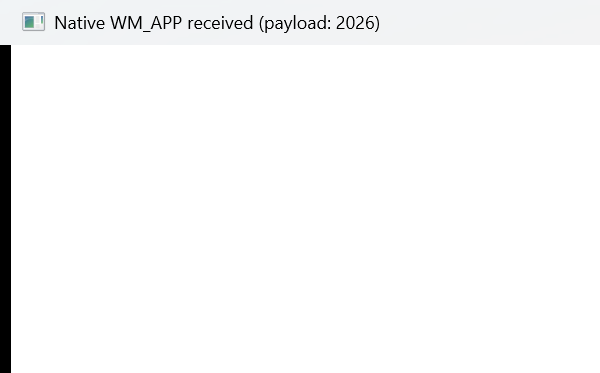</a><br><strong><a href="examples/native_message/main.cpp">Native message</a></strong><br><sub>A typed WM_APP message with a native payload.</sub></td>
  </tr>
  <tr>
    <td valign="top"><a href="examples/keyboard/main.cpp">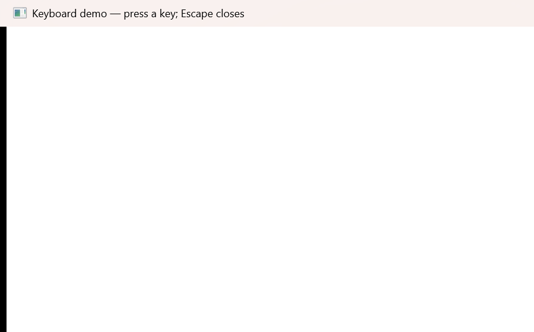</a><br><strong><a href="examples/keyboard/main.cpp">Keyboard</a></strong><br><sub>Virtual keys and Escape-to-close.</sub></td>
    <td valign="top"><a href="examples/mouse/main.cpp">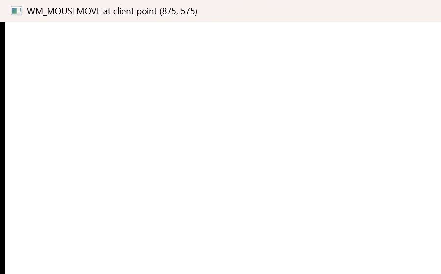</a><br><strong><a href="examples/mouse/main.cpp">Mouse</a></strong><br><sub>Native client coordinates and button input.</sub></td>
  </tr>
  <tr>
    <td valign="top"><a href="examples/resize/main.cpp"></a><br><strong><a href="examples/resize/main.cpp">Resize</a></strong><br><sub>WM_SIZE dimensions and window state.</sub></td>
    <td valign="top"><a href="examples/timer/main.cpp">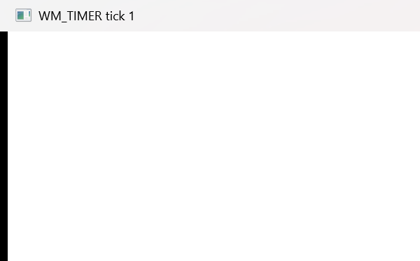</a><br><strong><a href="examples/timer/main.cpp">Timer</a></strong><br><sub>SetTimer, WM_TIMER, and deterministic cleanup.</sub></td>
  </tr>
  <tr>
    <td valign="top"><a href="examples/paint/main.cpp"></a><br><strong><a href="examples/paint/main.cpp">Native paint</a></strong><br><sub>Direct GDI rendering through WM_PAINT.</sub></td>
    <td valign="top"><a href="examples/minmax/main.cpp">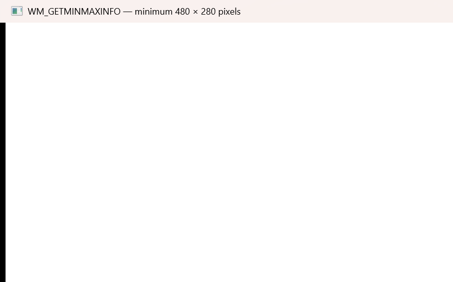</a><br><strong><a href="examples/minmax/main.cpp">Minimum size</a></strong><br><sub>Native tracking limits with WM_GETMINMAXINFO.</sub></td>
  </tr>
  <tr>
    <td valign="top"><a href="examples/close_policy/main.cpp">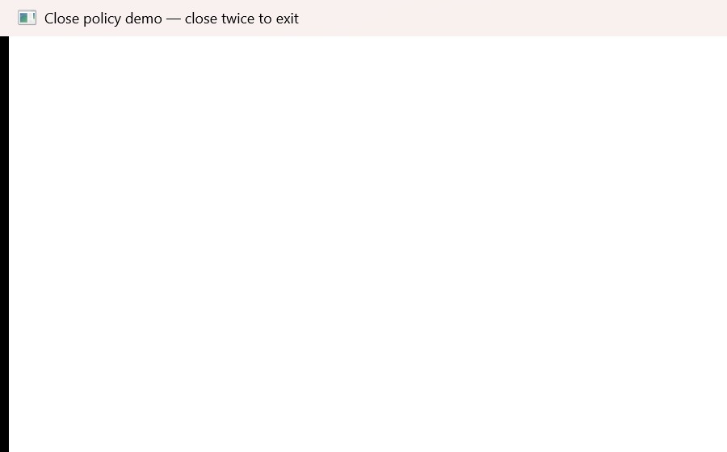</a><br><strong><a href="examples/close_policy/main.cpp">Close policy</a></strong><br><sub>Intercept WM_CLOSE while preserving application ownership.</sub></td>
    <td valign="top"><a href="examples/window_state/main.cpp"></a><br><strong><a href="examples/window_state/main.cpp">Window state</a></strong><br><sub>Restored, minimized, and maximized state.</sub></td>
  </tr>
  <tr>
    <td valign="top"><a href="examples/dpi/main.cpp">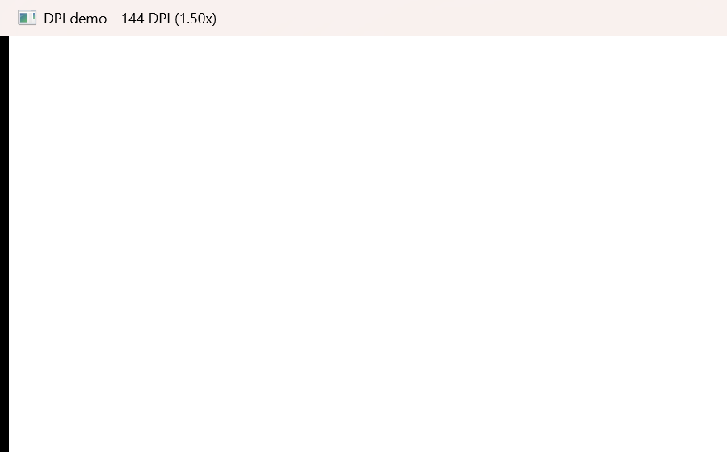</a><br><strong><a href="examples/dpi/main.cpp">DPI</a></strong><br><sub>Per-window scale and WM_DPICHANGED.</sub></td>
    <td valign="top"><a href="examples/window_options/main.cpp">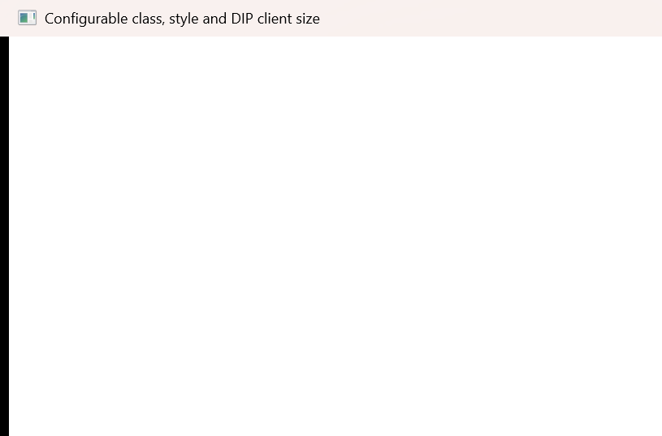</a><br><strong><a href="examples/window_options/main.cpp">Window options</a></strong><br><sub>Class traits, styles, DIP sizing, and centering.</sub></td>
  </tr>
  <tr>
    <td valign="top"><a href="examples/wait_aware/main.cpp">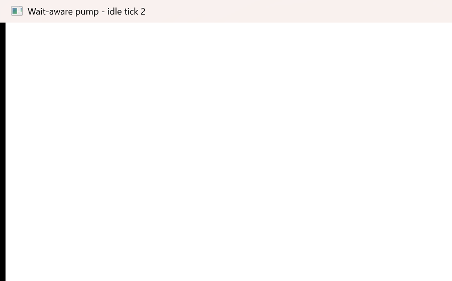</a><br><strong><a href="examples/wait_aware/main.cpp">Wait-aware pump</a></strong><br><sub>Messages and bounded idle work without busy polling.</sub></td>
    <td valign="top"><a href="examples/wakeup/main.cpp">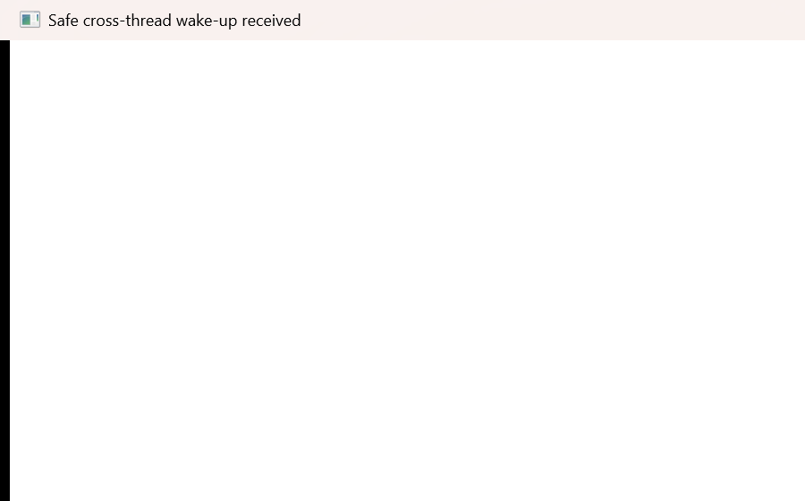</a><br><strong><a href="examples/wakeup/main.cpp">Safe wake-up</a></strong><br><sub>A C++20 jthread safely notifies the UI window.</sub></td>
  </tr>
  <tr>
    <td valign="top"><a href="examples/com_sta/main.cpp">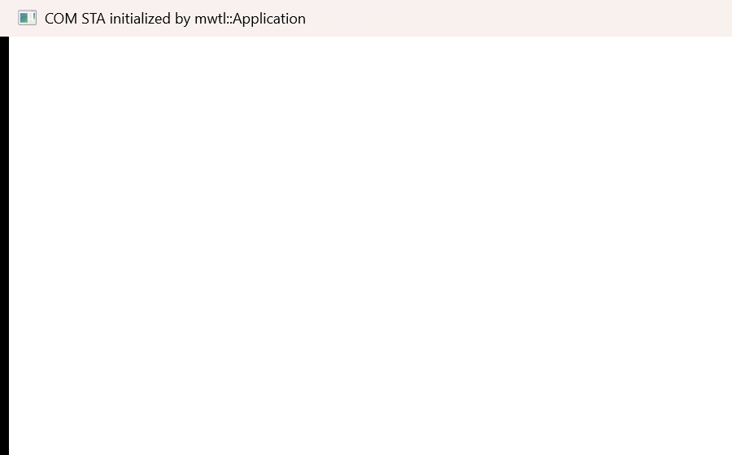</a><br><strong><a href="examples/com_sta/main.cpp">COM STA</a></strong><br><sub>Optional application-owned COM apartment lifetime.</sub></td>
    <td valign="top"><a href="examples/self_drawn_host/main.cpp">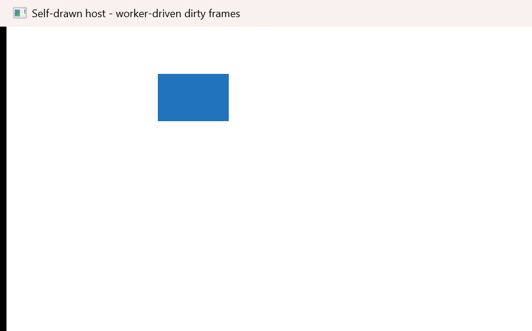</a><br><strong><a href="examples/self_drawn_host/main.cpp">Self-drawn host</a></strong><br><sub>Worker-driven dirty frames and native GDI.</sub></td>
  </tr>
  <tr>
    <td valign="top"><a href="examples/system_lifecycle/main.cpp">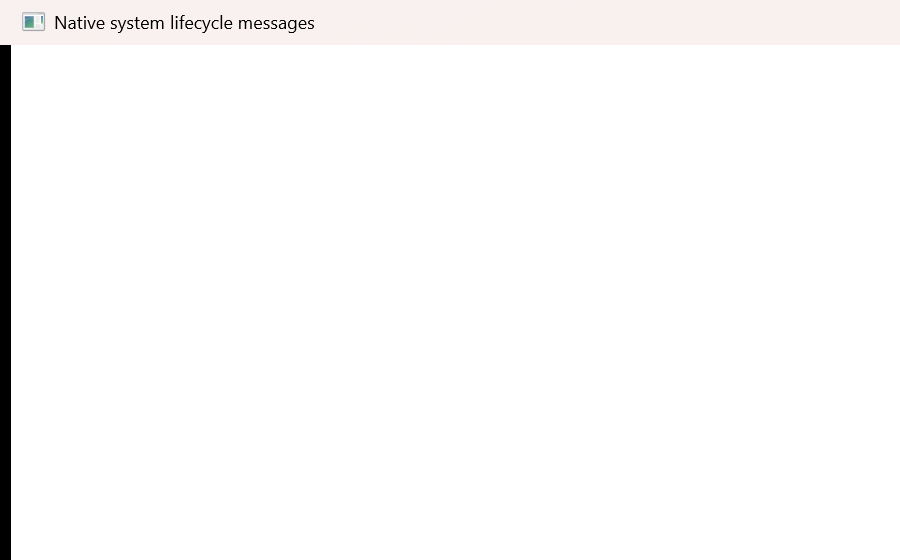</a><br><strong><a href="examples/system_lifecycle/main.cpp">System lifecycle</a></strong><br><sub>Power, display, settings, IME, session, and accessibility messages.</sub></td>
    <td valign="top"><br><strong>Native by design</strong><br><sub>Every example keeps its HWND and Win32 message surface open.</sub></td>
  </tr>
</table>

## Tests

`MWTL_BUILD_TESTS` defaults on for a top-level build and off when mwtl is embedded. The test suite covers:

- successful main-window creation and normal loop exit;
- deterministic module-initialization and message-loop-registration failure cleanup;
- `BuildUI` exception causing Create failure and nonzero Run result;
- a WTL message-handler exception being contained by the real WindowProc boundary;
- exact `CAppModule`/message-loop cleanup counts on each path;
- independent C++20 compilation of every public header;
- extraction and inspection of the final hello EXE manifest with the Windows SDK manifest tool.
- DPI conversion edge cases, C++20 consumption, custom class traits, COM STA,
  wait-handle dispatch, callback exception containment, 2,000-message wake-up
  bursts, idle CPU behavior, and a liney-style native host fixture.

The repository CI workflow builds and tests x64 Debug and Release and separately cross-builds Debug and Release for ARM64.

## GitHub Pages

The documentation site source is in [site/](site/). It includes a landing page, build guide, and one usage page for every current public component. The pinned-action workflow [.github/workflows/pages.yml](.github/workflows/pages.yml) uploads that directory directly to GitHub Pages.

After the repository is public, open **Settings → Pages**, select **GitHub Actions** as the source, then run the **Deploy GitHub Pages** workflow or push a change under `site/` to `main`. No Jekyll or Node build is required.

## Minimal application

```cpp
#include <mwtl/mwtl.h>

class MainWindow final : public mwtl::Window<MainWindow> {
public:
    void BuildUI() {
        SetTitle(L"mwtl Demo");
    }
};

int WINAPI wWinMain(HINSTANCE instance, HINSTANCE, PWSTR, int show_command) {
    try {
        return mwtl::Application(instance).Run<MainWindow>(show_command);
    } catch (...) {
        return EXIT_FAILURE;
    }
}
```

`BuildUI` is called during `WM_CREATE`, after the HWND is attached. `SetTitle` returns `bool` so callers that need to react to failure can do so without relying on exceptions. The HWND remains directly available through `GetHwnd()`, including for `::SendMessageW(GetHwnd(), ...)`.

The main-window C++ object is stack-owned by `Application::Run`; Win32/WTL manages its HWND. Closing this milestone-1 main window exits the one message loop. Multi-main-window lifetime policy is intentionally deferred.

## More code recipes

### Handle a WTL message and keep the native return value

```cpp
class KeyboardWindow final : public mwtl::Window<KeyboardWindow> {
public:
    void BuildUI() { SetTitle(L"Press Escape to close"); }

    BEGIN_MSG_MAP(KeyboardWindow)
        MESSAGE_HANDLER(WM_KEYDOWN, OnKeyDown)
        CHAIN_MSG_MAP(mwtl::Window<KeyboardWindow>)
    END_MSG_MAP()

private:
    LRESULT OnKeyDown(UINT, WPARAM key, LPARAM, BOOL& handled) {
        if (key == VK_ESCAPE) {
            return ::SendMessageW(GetHwnd(), WM_CLOSE, 0, 0);
        }
        handled = FALSE;
        return 0;
    }
};
```

### Post and receive an application-defined message

```cpp
constexpr UINT kRefresh = WM_APP + 1;

void BuildUI() {
    if (::PostMessageW(GetHwnd(), kRefresh, 42, 0) == FALSE) {
        throw std::runtime_error("PostMessageW failed");
    }
}

BEGIN_MSG_MAP(MainWindow)
    MESSAGE_HANDLER(kRefresh, OnRefresh)
    CHAIN_MSG_MAP(mwtl::Window<MainWindow>)
END_MSG_MAP()

LRESULT OnRefresh(UINT, WPARAM payload, LPARAM, BOOL&) {
    // payload == 42; GetHwnd() remains available for native Win32 calls.
    return 0;
}
```

### Observe resize without introducing a layout abstraction

```cpp
BEGIN_MSG_MAP(MainWindow)
    MESSAGE_HANDLER(WM_SIZE, OnSize)
    CHAIN_MSG_MAP(mwtl::Window<MainWindow>)
END_MSG_MAP()

LRESULT OnSize(UINT, WPARAM state, LPARAM size, BOOL& handled) {
    const unsigned width = LOWORD(size);
    const unsigned height = HIWORD(size);
    // Use native pixel values in milestone 1. DIP layout is intentionally later.
    handled = FALSE;
    return 0;
}
```

### Own a Win32 timer with explicit cleanup

```cpp
void BuildUI() {
    if (::SetTimer(GetHwnd(), 1, 1000, nullptr) == 0) {
        throw std::runtime_error("SetTimer failed");
    }
}

BEGIN_MSG_MAP(MainWindow)
    MESSAGE_HANDLER(WM_TIMER, OnTimer)
    MESSAGE_HANDLER(WM_DESTROY, OnDestroy)
    CHAIN_MSG_MAP(mwtl::Window<MainWindow>)
END_MSG_MAP()

LRESULT OnDestroy(UINT, WPARAM, LPARAM, BOOL& handled) {
    ::KillTimer(GetHwnd(), 1);
    handled = FALSE; // allow the base window to post the quit message
    return 0;
}
```

The full compilable forms of these recipes live under `examples/`; the snippets above intentionally omit the process entry point for focus.

## License

mwtl is licensed under the MIT License. See [LICENSE](LICENSE). Third-party dependencies retain their own licenses and do not imply Microsoft or upstream endorsement.
