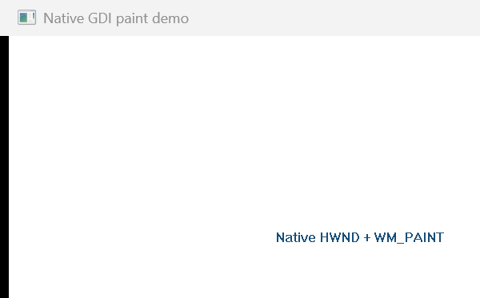
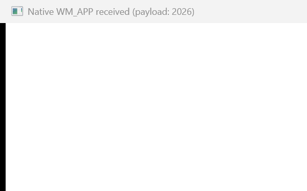
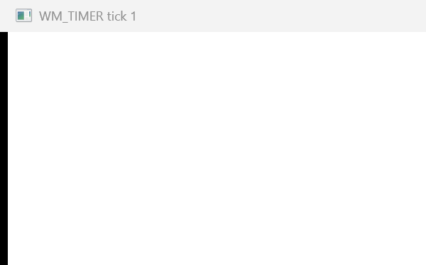

# mwtl

`mwtl` is a lightweight, Windows-only modern C++ foundation built on ATL/WTL and Microsoft WIL. It keeps native HWND and Win32 message interoperability while reducing application/bootstrap boilerplate and making lifetime and error boundaries explicit.

The project is not a replacement for Qt, WinUI, XAML/QML, or a cross-platform/full-visual UI framework. It favors native Windows controls and does not hide HWNDs.

## Current status

Milestone 1 provides:

- a CMake static library target named `mwtl::mwtl`;
- pinned official WTL and WIL dependencies;
- `mwtl::Application` with WTL `CAppModule` and message-loop lifetime management;
- a CRTP `mwtl::Window<T>` main-window base with native HWND access;
- exception containment around real WTL window-message dispatch and `wWinMain`;
- Unicode-only compilation and a Per-Monitor DPI Awareness V2 manifest for the hello executable;
- a blank, closable `examples/hello` quick start;
- focused `Application` and `Window<T>` component demos under `examples/`;
- CTest coverage for normal exit, creation failure cleanup, message-handler exceptions, public-header independence, and the embedded DPI manifest;
- a static component documentation site under `site/`, ready for GitHub Pages deployment.

There is currently no DIP/geometry API, DPI relayout, layout system, control DSL/wrappers, theme/font system, dispatcher, Mica/backdrop, Direct2D, or DirectWrite support.

## Requirements

- Windows 10 version 1809 or newer, or Windows 11;
- x64 or ARM64;
- Visual Studio 2022 with the MSVC C++ desktop tools, Windows SDK, and C++ ATL component;
- CMake 3.21 or newer;
- C++17 (`/std:c++17`); no C++20 feature is required.

Milestone 1 intentionally fails during CMake configuration on non-Windows, non-MSVC, and 32-bit targets. MinGW and clang-cl are not supported.

## Dependencies

The default configuration fetches immutable commits from the official WTL SourceForge repository and Microsoft WIL GitHub repository. Exact tags, commits, and licenses are recorded in [THIRD_PARTY_NOTICES.md](THIRD_PARTY_NOTICES.md).

For offline builds, provide both checked-out source trees:

```powershell
cmake -S . -B build/x64 `
  -G "Visual Studio 17 2022" -A x64 `
  -DMWTL_WTL_SOURCE_DIR=C:/deps/wtl `
  -DMWTL_WIL_SOURCE_DIR=C:/deps/wil
```

An embedding project may instead define `WTL::WTL` and `WIL::WIL` targets before calling `add_subdirectory(mwtl)`. If either target is already present, mwtl uses it and does not fetch that dependency. It never searches silently for an unidentified system copy.

## Build and run

The checked-in presets provide the shortest path when dependencies can be fetched:

```powershell
cmake --preset vs2022-x64
cmake --build --preset x64-debug
ctest --preset x64-debug
```

From a Visual Studio Developer PowerShell, configure once and build Debug x64:

```powershell
cmake -S . -B build/x64 -G "Visual Studio 17 2022" -A x64 `
  -DMWTL_BUILD_EXAMPLES=ON -DMWTL_BUILD_TESTS=ON
cmake --build build/x64 --config Debug --verbose
ctest --test-dir build/x64 -C Debug --output-on-failure
./build/x64/examples/hello/Debug/mwtl_hello.exe
```

Build Release x64:

```powershell
cmake --build build/x64 --config Release --verbose
ctest --test-dir build/x64 -C Release --output-on-failure
./build/x64/examples/hello/Release/mwtl_hello.exe
```

On a machine with the MSVC ARM64 compiler, ARM64 ATL libraries, and ARM64 Windows SDK libraries installed:

```powershell
cmake -S . -B build/arm64 -G "Visual Studio 17 2022" -A ARM64
cmake --build build/arm64 --config Debug --verbose
cmake --build build/arm64 --config Release --verbose
```

When mwtl is included with `add_subdirectory`, examples and tests default to off. Set `MWTL_BUILD_EXAMPLES=ON` or `MWTL_BUILD_TESTS=ON` explicitly when the parent wants them.

## Component examples

The repository contains **12 independently buildable GUI examples**. They are all managed by [examples/CMakeLists.txt](examples/CMakeLists.txt) and share the same Unicode, C++17, warning, and Per-Monitor V2 manifest setup.

| Component | Directory | CMake target | Demonstrates |
|---|---|---|---|
| Quick start | `examples/hello` | `mwtl_hello` | Smallest complete program |
| `mwtl::Application` | `examples/application` | `mwtl_application_demo` | HINSTANCE observation, Run, exit code, and wWinMain boundary |
| `mwtl::Window<T>` | `examples/window` | `mwtl_window_demo` | HWND access, WTL message maps, WM_APP messages, and direct WM_CLOSE |
| Native message | `examples/native_message` | `mwtl_native_message_demo` | Typed `WM_APP` constant, payload, `PostMessageW`, and a WTL handler |
| Keyboard | `examples/keyboard` | `mwtl_keyboard_demo` | `WM_KEYDOWN`, virtual-key values, and Escape-to-close |
| Mouse | `examples/mouse` | `mwtl_mouse_demo` | Client coordinates from `WM_MOUSEMOVE` and `WM_LBUTTONDOWN` |
| Resize | `examples/resize` | `mwtl_resize_demo` | Width, height, and state from `WM_SIZE` |
| Timer | `examples/timer` | `mwtl_timer_demo` | `SetTimer`, `WM_TIMER`, and deterministic `KillTimer` cleanup |
| Native paint | `examples/paint` | `mwtl_paint_demo` | Direct HWND/GDI interoperability through `WM_PAINT` |
| Minimum size | `examples/minmax` | `mwtl_minmax_demo` | A native minimum tracking size through `WM_GETMINMAXINFO` |
| Close policy | `examples/close_policy` | `mwtl_close_policy_demo` | Intercepting `WM_CLOSE` without changing `Application` lifetime policy |
| Window state | `examples/window_state` | `mwtl_window_state_demo` | Restored, minimized, and maximized state from `WM_SIZE` |

Build any one directly, for example:

```powershell
cmake --build build/x64 --config Debug --target mwtl_native_message_demo
./build/x64/examples/native_message/Debug/mwtl_native_message_demo.exe
```

See [examples/README.md](examples/README.md) for the complete target and run-command index.

### Screenshots

These images are captured from the actual x64 Debug executables in this repository.

| Native `WM_PAINT` | Custom `WM_APP` message | Win32 timer |
|---|---|---|
|  |  |  |

## Tests

`MWTL_BUILD_TESTS` defaults on for a top-level build and off when mwtl is embedded. The test suite covers:

- successful main-window creation and normal loop exit;
- deterministic module-initialization and message-loop-registration failure cleanup;
- `BuildUI` exception causing Create failure and nonzero Run result;
- a WTL message-handler exception being contained by the real WindowProc boundary;
- exact `CAppModule`/message-loop cleanup counts on each path;
- independent C++17 compilation of every public header;
- extraction and inspection of the final hello EXE manifest with the Windows SDK manifest tool.

The repository CI workflow builds and tests x64 Debug and Release and separately cross-builds Debug and Release for ARM64.

## GitHub Pages

The documentation site source is in [site/](site/). It includes a landing page, build guide, and one usage page for every current public component. The pinned-action workflow [.github/workflows/pages.yml](.github/workflows/pages.yml) uploads that directory directly to GitHub Pages.

After the repository is public, open **Settings → Pages**, select **GitHub Actions** as the source, then run the **Deploy GitHub Pages** workflow or push a change under `site/` to `main`. No Jekyll or Node build is required.

## Minimal application

```cpp
#include <mwtl/mwtl.h>

class MainWindow final : public mwtl::Window<MainWindow> {
public:
    void BuildUI() {
        SetTitle(L"mwtl Demo");
    }
};

int WINAPI wWinMain(HINSTANCE instance, HINSTANCE, PWSTR, int show_command) {
    try {
        return mwtl::Application(instance).Run<MainWindow>(show_command);
    } catch (...) {
        return EXIT_FAILURE;
    }
}
```

`BuildUI` is called during `WM_CREATE`, after the HWND is attached. `SetTitle` returns `bool` so callers that need to react to failure can do so without relying on exceptions. The HWND remains directly available through `GetHwnd()`, including for `::SendMessageW(GetHwnd(), ...)`.

The main-window C++ object is stack-owned by `Application::Run`; Win32/WTL manages its HWND. Closing this milestone-1 main window exits the one message loop. Multi-main-window lifetime policy is intentionally deferred.

## More code recipes

### Handle a WTL message and keep the native return value

```cpp
class KeyboardWindow final : public mwtl::Window<KeyboardWindow> {
public:
    void BuildUI() { SetTitle(L"Press Escape to close"); }

    BEGIN_MSG_MAP(KeyboardWindow)
        MESSAGE_HANDLER(WM_KEYDOWN, OnKeyDown)
        CHAIN_MSG_MAP(mwtl::Window<KeyboardWindow>)
    END_MSG_MAP()

private:
    LRESULT OnKeyDown(UINT, WPARAM key, LPARAM, BOOL& handled) {
        if (key == VK_ESCAPE) {
            return ::SendMessageW(GetHwnd(), WM_CLOSE, 0, 0);
        }
        handled = FALSE;
        return 0;
    }
};
```

### Post and receive an application-defined message

```cpp
constexpr UINT kRefresh = WM_APP + 1;

void BuildUI() {
    if (::PostMessageW(GetHwnd(), kRefresh, 42, 0) == FALSE) {
        throw std::runtime_error("PostMessageW failed");
    }
}

BEGIN_MSG_MAP(MainWindow)
    MESSAGE_HANDLER(kRefresh, OnRefresh)
    CHAIN_MSG_MAP(mwtl::Window<MainWindow>)
END_MSG_MAP()

LRESULT OnRefresh(UINT, WPARAM payload, LPARAM, BOOL&) {
    // payload == 42; GetHwnd() remains available for native Win32 calls.
    return 0;
}
```

### Observe resize without introducing a layout abstraction

```cpp
BEGIN_MSG_MAP(MainWindow)
    MESSAGE_HANDLER(WM_SIZE, OnSize)
    CHAIN_MSG_MAP(mwtl::Window<MainWindow>)
END_MSG_MAP()

LRESULT OnSize(UINT, WPARAM state, LPARAM size, BOOL& handled) {
    const unsigned width = LOWORD(size);
    const unsigned height = HIWORD(size);
    // Use native pixel values in milestone 1. DIP layout is intentionally later.
    handled = FALSE;
    return 0;
}
```

### Own a Win32 timer with explicit cleanup

```cpp
void BuildUI() {
    if (::SetTimer(GetHwnd(), 1, 1000, nullptr) == 0) {
        throw std::runtime_error("SetTimer failed");
    }
}

BEGIN_MSG_MAP(MainWindow)
    MESSAGE_HANDLER(WM_TIMER, OnTimer)
    MESSAGE_HANDLER(WM_DESTROY, OnDestroy)
    CHAIN_MSG_MAP(mwtl::Window<MainWindow>)
END_MSG_MAP()

LRESULT OnDestroy(UINT, WPARAM, LPARAM, BOOL& handled) {
    ::KillTimer(GetHwnd(), 1);
    handled = FALSE; // allow the base window to post the quit message
    return 0;
}
```

The full compilable forms of these recipes live under `examples/`; the snippets above intentionally omit the process entry point for focus.

## License

mwtl is licensed under the MIT License. See [LICENSE](LICENSE). Third-party dependencies retain their own licenses and do not imply Microsoft or upstream endorsement.
